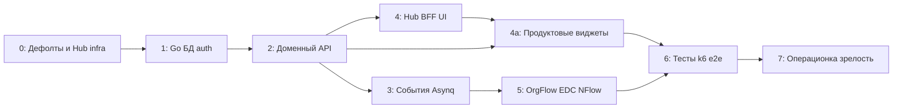

# План: AprilProfile — от шаблона к рабочему сервису с интеграцией AprilHub

- **Задача:** [`TASK.md`](./TASK.md)
- **Дата плана:** 2026-04-17
- **Статус плана:** согласован (рабочая дорожная карта; уточнять по мере появления кода и стендов)

## Как вести работу с агентом

План исходит из того, что **реализацию в основном делаете вы вместе с агентом** (например Cursor), а не отдельная «классическая» команда только людей.

| Роль | Ответственность |
|------|-----------------|
| **Вы** | Направление, приоритет фаз, принятие решений по границам с ADR, доступы к стендам/Keycloak/Hub, **merge в основную ветку**, согласование с владельцами AprilHub. |
| **Агент** | Написание и правка кода по задаче, рефакторинг в рамках запроса, запуск проверок (`make`, тесты), обновление OpenAPI рядом с кодом, мелкие правки доков по согласованию. |

**Практика сессий:** дробить работу на **короткие задачи с явным критерием готовности** (один PR / одна ветка / один фокус). После каждого существенного шага — **прогон CI и ручной smoke** на dev; не накапливать недельный дифф без проверок.

**Где агент слабее:** секреты и прод-конфигурация, нестандартные инциденты на стенде, договорённости с людьми из репозитория Hub — это **ваша** зона; в плане это отмечено как ручные контрольные точки.

**Контекст агенту:** ссылаться на [`docs/DESIGN_AprilProfile.md`](../../docs/DESIGN_AprilProfile.md), ADR-0002/0003/0004, [`docs/FRONTEND_STRATEGY.md`](../../docs/FRONTEND_STRATEGY.md), [`docs/DECISION_MATRIX_UI_INTEGRATION.md`](../../docs/DECISION_MATRIX_UI_INTEGRATION.md), актуальный OpenAPI; при смене контракта — править спецификацию в том же изменении (как принято в репо).

---

## Три модели интеграции UI (Host / Widget / API–BFF-first)

Экосистема April использует **гибрид** (ADR-0004): допускаются **Host-driven** (экран в AprilHub), **Widget-driven** (пакеты `@april/*-ui`), **API/BFF-first** (тонкий клиент без развитого слоя виджетов). Единые правила: [`docs/WIDGET_CONTRACTS.md`](../../docs/WIDGET_CONTRACTS.md), [`docs/VERSIONING_AND_COMPATIBILITY.md`](../../docs/VERSIONING_AND_COMPATIBILITY.md).

### Матрица выбора (сжато)

| Сигнал | Предпочтительный режим |
|--------|-------------------------|
| Блок нужен в ≥2 командах/репозиториях с одинаковым UX | Widget-driven (`@april/*-ui`) |
| Уникальный оркестрационный экран, сложная IA | Host-driven |
| Ранний этап, нет npm-виджета, достаточно API | API/BFF-first → позже миграция к виджету при стабилизации UX |

Полная матрица и anti-patterns — [`docs/DECISION_MATRIX_UI_INTEGRATION.md`](../../docs/DECISION_MATRIX_UI_INTEGRATION.md).

### Фазирование внедрения гибрида

1. **Фаза документации (текущий трек):** ADR-0004, контракты v1, чеклисты релиза/интеграции, шаблоны спецификаций — задача [`003-hybrid-ui-integration-governance`](../003-hybrid-ui-integration-governance/).
2. **Фаза пилота:** один виджет v1 (например карточка профиля) в Hub с `HostContext` и событиями по контракту; smoke + observability по [`docs/WIDGET_OBSERVABILITY_GUIDE.md`](../../docs/WIDGET_OBSERVABILITY_GUIDE.md).
3. **Фаза масштабирования:** новые доменные блоки по шаблонам; semver и обновление Hub при major; при необходимости — согласование Module Federation без смены контрактов props/events.

Связь с **фазой 4.2** дорожной карты (BFF + UI): гибридная модель **не заменяет** поэтапную реализацию backend; задаёт правила для фронта и пакетов.

---

## Исходные допущения

- **Текущее состояние репозитория:** дизайн и ADR (0002, 0003) готовы; OpenAPI — заготовка (`/healthz`, `/readyz`); бэкенда на Go в репо пока нет; `frontend/` — shell под DS April.
- **AprilHub** — репозиторий [april-worker](https://github.com/ukituki-ps/april-worker): общий контур observability, onboarding стендов, эталонные CI/тесты; **полный стек наблюдаемости в april-profile не копируется** без отдельного ADR.
- **Соседние сервисы** (AprilOrgFlow, EDC, NFlow): контракты и dev-стенды могут догонять Profile; в плане заложены **зависимости**, **заглушки** и **моки**, пока внешнее API не стабильно.

Оценки по времени **намеренно не приводятся**: скорость определяется размером инкрементов, глубиной ревью и доступностью стендов, а не календарём.

---

## Фаза 0 — Репозиторий, дефолты, выравнивание с AprilHub

**Сначала:** подставить плейсхолдеры хостов и путей; зафиксировать имена для OIDC, gateway, runner labels; в README или заметке кратко описать, **как** сервис подключается к контуру Hub (метрики/логи по runbook april-worker); вести `task_list`.

**Затем:** branch protection, секреты CI (`SUBMODULES_TOKEN` и др.), согласованный `APRIL_DEPLOY_ROOT`; smoke после деплоя описан и реально выполняется на dev.

**Затрагиваемые области:** `docs/guides/`, `README`, `.github/workflows/`, при необходимости ADR «подключение к Hub».

**Зависимости:** нет.

---

## Фаза 1 — Каркас Go, PostgreSQL, Redis, OIDC/tenant, health

**Сначала:** `go.mod`, модульный монолит; миграции БД; таблицы минимум под tenant и заготовку сущностей; валидация JWT Keycloak; **`tenant_id` только из доверенного контекста**; `/healthz`, `/readyz`; образ в ghcr; деплой по [`docs/DEPLOYMENT_STRATEGY.md`](../../docs/DEPLOYMENT_STRATEGY.md).

**Затем:** структурированные логи, `request_id`, readiness зависит от БД/Redis; конфиг и секреты только через env; базовые интеграционные тесты (БД).

**Зависимости:** фаза 0.

---

## Фаза 2 — Доменный REST API и OpenAPI

**Сначала:** каталог типов сущностей (черновик/публикация схем); CRUD сущности и **append-only** версии профиля; чтение текущей и по номеру версии; маппинг внешних ключей; OpenAPI синхронизирован; `check-openapi-compat` в CI.

**Затем:** authority/merge по полю и namespace; очередь конфликтов и ручное разрешение; явный merge дубликатов с аудитом; фильтрация выдачи по ABAC (сегменты полей).

**Зависимости:** фаза 1.

---

## Фаза 3 — События и Asynq

**Сначала:** контракт события (ADR-0003); outbox или согласованный брокер; идемпотентность на стороне публикации; Asynq-задачи для фоновых сценариев (хотя бы ping + одна реальная задача).

**Затем:** синки с checkpoint; метрики лага по `source_system`; ретраи и DLQ по договорённости.

**Зависимости:** фаза 2 (нужны изменения профиля как триггер).

---

## Фаза 4 — Интеграция с AprilHub (платформа + продукт)

### 4.1 Платформа

**Сначала:** `GET /metrics` (Prometheus), логи в формате, пригодном для Promtail/Loki; корреляция `request_id`.

**Детализация и контракт с AprilHub (april-worker):** задача [`018-phase-4-prometheus-metrics-logs-correlation`](../018-phase-4-prometheus-metrics-logs-correlation/) (`TASK.md`: job `aprilhub_dynamic_targets`, file SD `overlays/targets/*.yml`, логи JSON, поля `requestId`/`correlationId`, ссылки на runbook'и в [april-worker](https://github.com/ukituki-ps/april-worker)).

**Затем:** дашборды и алерты согласованы с командой Hub; черновик SLO.

### 4.2 Продукт (BFF + UI)

**Сначала:** сценарий на dev: BFF Hub проксирует к Profile с tenant; админ-маршруты `/admin/profile/...` или согласованный префикс; один OIDC-клиент.

**Затем:** пакет `@april/profile-ui` (или согласованное имя) + генерация клиента из OpenAPI; встраиваемый компонент с `onSaveSuccess` по [`docs/FRONTEND_STRATEGY.md`](../../docs/FRONTEND_STRATEGY.md); e2e smoke.

**Зависимости:** фазы 1–2 минимум для сквозного сценария; координация с репозиторием Hub — **ручная контрольная точка**.

---

## Фаза 4a — Продуктовые виджеты поверх интеграционного контура

Фаза 4a расширяет 4.2: после того как сквозной контур Hub BFF OIDC и базовый `@april/profile-ui` работает, добавляются прикладные виджеты для ежедневной админ-операционки.

### 4a.0 UI shell-каркас AprilHub (sidebar/tabs/routes) для profile-виджетов

**Сначала:** закрепить информационную архитектуру profile-домена в Hub: структура sidebar, политика `tab vs route`, канонические URL и deep-link правила.

**Затем:** зафиксировать host-shell контракт (`HostContext`, layout, `loading/empty/error/forbidden`, breadcrumbs/back-navigation), чтобы все виджеты 4a подключались единообразно.

**Выход артефактов:** базовый shell-навигационный каркас в Hub и интеграционный гайд, на который опираются задачи 4a.1-4a.5.

### 4a.1 Виджет списка профилей и базовый CRUD

**Сначала:** `ProfilesListWidget` с таблицей, поиском, фильтрами и пагинацией; загрузка через BFF Hub в tenant-контексте; единые состояния `loading/empty/error`.

**Затем:** действия create/edit/delete (или archive, если удаление ограничено контрактом), подтверждение опасных операций, обработка 401/403/409 без утечки деталей.

**Выход артефактов:** отдельный экспорт в `@april/profile-ui`, пример интеграции для Host, smoke-сценарий в docs.

### 4a.2 Виджет списка экземпляров в контексте профиля и CRUD экземпляра

**Сначала:** `ProfileInstancesWidget` на основе `profileId`: список экземпляров, сортировка по времени изменения, открытие карточки экземпляра.

**Затем:** create/edit для экземпляра, согласованная политика удаления/архивации, отражение ограничений ABAC в UI (`hidden/readonly/denied`) по фактическому поведению API.

**Выход артефактов:** контракт props/events для виджета, тестовые фикстуры MSW, раздел в каталоге виджетов проекта.

### 4a.3 Виджет истории экземпляра (версии и аудит изменений)

**Сначала:** `InstanceHistoryWidget` с таймлайном append-only версий, просмотром метаданных версии (кто, когда, источник изменения).

**Затем:** просмотр снапшота выбранной версии и diff с текущей/предыдущей; если API разрешает восстановление версии, отдельный защищённый сценарий restore с аудитом.

**Выход артефактов:** минимальный e2e happy-path «изменение -> новая версия -> просмотр истории», раздел «ограничения истории» в docs.

### 4a.4 UI-поток разрешения конфликтов и merge-дубликатов

**Сначала:** админская очередь конфликтов (`ConflictQueueWidget`) с фильтрами и детальным просмотром конфликтного поля/namespace.

**Затем:** ручное разрешение конфликта и запуск merge-дубликатов через API фазы 2, с обязательным отображением результата и ссылкой на аудиторный след операции.

**Выход артефактов:** тест-кейсы на отрицательные сценарии прав и race-condition, явное описание ролей в Keycloak для конфликтных действий.

### 4a.5 Сквозное качество, наблюдаемость и релизная готовность виджетов

**Сначала:** единые события виджетов (`view_loaded`, `save_submitted`, `save_succeeded`, `save_failed`) и корреляция с `request_id/correlation_id` из Hub.

**Затем:** матрица совместимости версий виджетов и Host (semver), регламент обновления при breaking change, обязательный smoke/e2e на критичный путь каждого виджета.

**Зависимости:** фаза 4.2 завершена (контур интеграции стабилен), фаза 2 реализована минимум до API для CRUD/versions/conflicts; `4a.0` (единый shell-каркас Hub) подготовлен; координация с AprilHub по маршрутам и e2e — ручная контрольная точка.

---

## Фаза 5 — Соседние сервисы экосистемы

**Сначала:** клиент к AprilOrgFlow для валидации ссылок `org_node_id` / `position_id` (или временные флаги «мягкой» валидации до готовности стенда).

**Затем:** EDC whitelist типов/полей; подписка NFlow на события; согласованные контракты с AprilReport (read-only API / витрина).

**Зависимости:** фазы 2–3.

---

## Фаза 6 — Качество и нагрузка

**Сначала:** `go test`, интеграционные тесты с Testcontainers; линтеры в CI.

**Затем:** k6 на критичные пути; Playwright e2e (админ + встраиваемый сценарий); расширение по [`docs/TESTING_STRATEGY.md`](../../docs/TESTING_STRATEGY.md) и паттернам april-worker.

Часть проверок можно наращивать **параллельно** фазам 2–4a, не откладывая всё на конец.

**Зависимости:** фазы 2–4a.

---

## Фаза 7 — Эксплуатация и зрелость

**Сначала:** `pg_dump` перед миграциями на dev; скрипты миграций в пайплайне.

**Затем:** runbooks, rollback образов и миграций; резервное копирование prod; security review PII; семвер релизов и npm-пакетов UI.

**Зависимости:** фазы 1–6.

---

## Порядок работ (шаги)

1. Завершить фазу 0; зафиксировать с владельцами Hub контракт (URL, BFF, OIDC).
2. Реализовать фазу 1; вывести на dev smoke (агент может сопровождать; доступы — у вас).
3. Итеративно наращивать фазу 2: сначала типы + одна сущность + версии, затем остальное.
4. Подключить фазу 3 после первого стабильного write-пути.
5. Параллельно со стабилизацией API: 4.1 (метрики/логи), затем 4.2 (UI + BFF).
6. После стабилизации базового UI-контура выполнить `4a.0` (единый shell-каркас Hub), затем `4a.1`-`4a.5` как отдельные инкременты.
7. Фаза 5 по готовности внешних сервисов; фазы 2–4a не блокировать заглушками дольше необходимого.
8. Фаза 6 — непрерывно; фаза 7 — перед прод-релизом.

## Зависимости (граф)

## Затрагиваемые области

| Область | Что меняется (кратко) |
|--------|------------------------|
| Backend (Go) | Модульный монолит, REST, очередь, outbox, адаптеры |
| Frontend | `frontend/`, пакет для Hub, админка |
| БД | PostgreSQL, миграции, индексы JSONB/GIN по мере нужды |
| Инфра / Compose | Сервис в compose dev, образы ghcr, nginx |
| Документация / OpenAPI | Эволюция `openapi/openapi.yaml`, Docusaurus при публичных правках |
| AprilHub | BFF, маршруты, observability — координация, не дублирование стека |

## Риски и откат

| Риск | Митигация |
|------|-----------|
| Внешние сервисы не готовы | Заглушки, feature flags, контракт-тесты против mock |
| Scope метамодели раздувается | Сужать первый сквозной сценарий: 2–3 типа сущностей, затем расширять |
| Расхождение UI Hub и Profile | Semver пакета, общий DS, явное обновление Hub при breaking |
| Сложность merge/authority | Юнит-тесты правил; ADR при изменении поведения |
| Длинные сессии агента без ревью | Обрезать задачи по размеру; обязательный зелёный CI перед merge |

Откат: откат образов по `images.env` и миграций — см. [`docs/DEPLOYMENT_STRATEGY.md`](../../docs/DEPLOYMENT_STRATEGY.md).

## Проверка после выполнения (по фазам)

- CI зелёный: `make openapi-lint`, `make docs-build`, после появления кода — `go test ./...`, `make frontend-build`.
- Smoke на dev: health, один доменный сценарий, логин через Keycloak при наличии.
- Согласование с Hub: метрики видны в общем Grafana; BFF отдаёт корректный tenant.

## Примечания

- Связанные ADR: [`docs/adr/0002-april-profile-scope-and-multitenancy.md`](../../docs/adr/0002-april-profile-scope-and-multitenancy.md), [`docs/adr/0003-april-profile-data-model-policies.md`](../../docs/adr/0003-april-profile-data-model-policies.md).
- **Фаза 0 в задачах:** [`001-phase-0-placeholders-oidc-runner-hub-docs`](../001-phase-0-placeholders-oidc-runner-hub-docs/) (часть 1), [`002-phase-0-branch-ci-secrets-smoke-deploy`](../002-phase-0-branch-ci-secrets-smoke-deploy/) (часть 2) — см. также [`task_list.md`](../../task_list.md).
- **Гибридная UI-модель (отдельный трек документации):** [`003-hybrid-ui-integration-governance`](../003-hybrid-ui-integration-governance/) — Host-driven / Widget-driven / API–BFF-first, контракты виджетов и governance; пересекается с фазой 4.2 и [`docs/FRONTEND_STRATEGY.md`](../../docs/FRONTEND_STRATEGY.md), но не заменяет фазы реализации.
- Подзадачи по фазам 1+ заводить в `tasks/` со следующими свободными номерами (например `004-…`, `005-…`) — удобные для агента куски: bootstrap backend, метамодель, события, UI-пакет.
- **Обновления плана:** при смене scope — править фазы и статус в шапке; оценки по времени не ведём.
