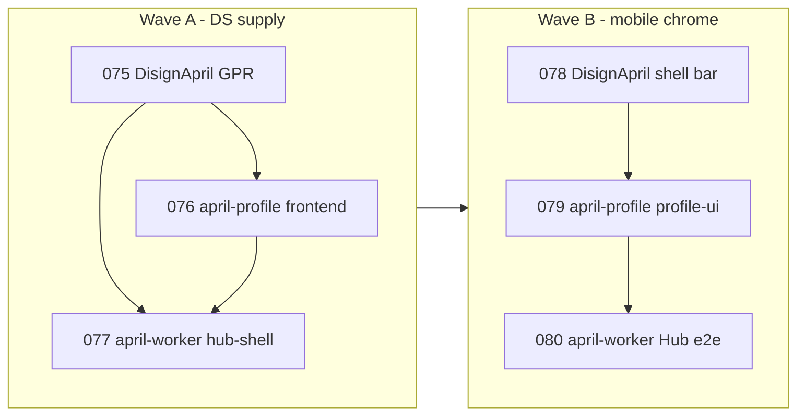

# План эпика 074: Фаза 8 — GPR для DS + `AprilMobileShellBar`

## Зависимости между подзадачами

- **077** логически после **075** (пакеты в registry) и желательно после **076** (зафиксированная semver-линия в profile, чтобы hub-shell выровнять на ту же версию).
- **Волна B** начинается после **076+077** зелёных на `develop` (или согласованных PR), чтобы не смешивать смену поставки с крупным UX-рефактором без базовой линии GPR.

## Порядок merge (рекомендация)

1. **075** — в GPR опубликованы (или подтверждены) **`@ukituki-ps/april-tokens`** и **`@ukituki-ps/april-ui`** нужной линии (`^0.1.9` или согласованный bump).
2. **076** — april-profile: `frontend/package.json` + lock, удаление `vendor/ds-packs/*.tgz`, доки; merge в `develop`.
3. **077** — april-worker: `hub-shell` на те же пакеты; упростить `ds:prepare` при отсутствии `file:` на DS; CI с `NODE_AUTH_TOKEN`; merge в `develop`.
4. **078** — DisignApril: контракт/код/тесты `AprilMobileShellBar` (+ при необходимости смежные примитивы); publish новой версии UI.
5. **076/077** — точечный bump lock на версию из **078**, если потребовался новый patch/minor.
6. **079** — april-profile: `profile-ui` + shell под стратегию A и ADR-0006.
7. **080** — april-worker: согласование глобального dock, e2e smoke mobile.

## Риски

- **GPR недоступен в CI** без `packages:read` и токена — см. существующие workflows april-profile и april-worker.
- **Две копии DS** при ошибочном оставлении `file:` в одном репо и GPR в другом — контроль через lock и чеклист в **076/077**.
- **Breaking в DS** между **078** и **079** — semver и отдельный bump **076** после publish.

## Ссылки

- Дочерние `TASK.md`: **075**, **076**, **077**, **078**, **079**, **080**.
